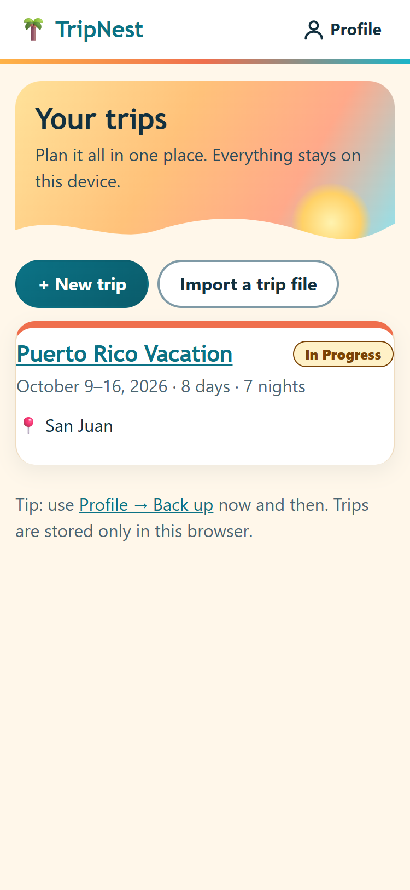
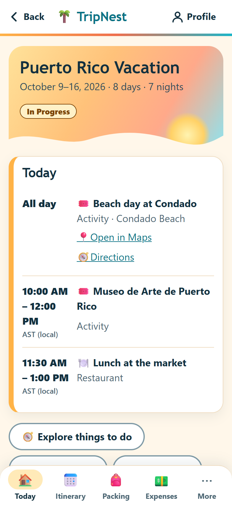
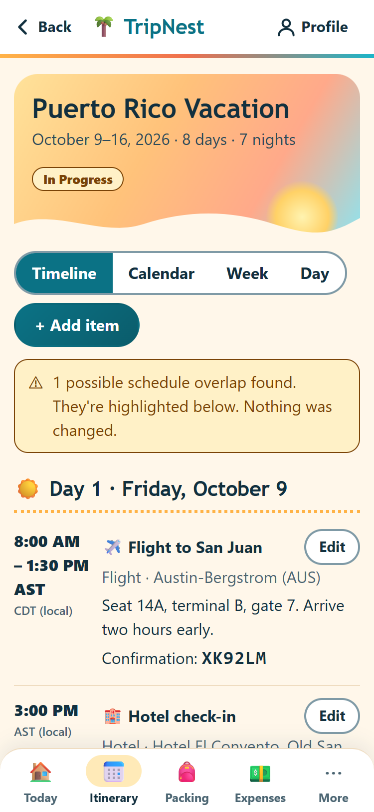
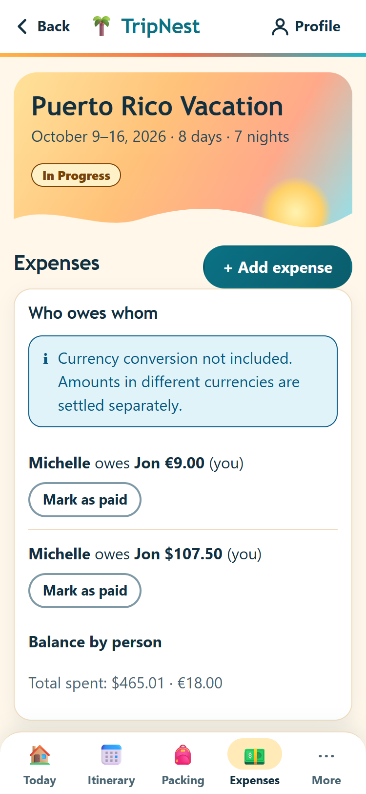
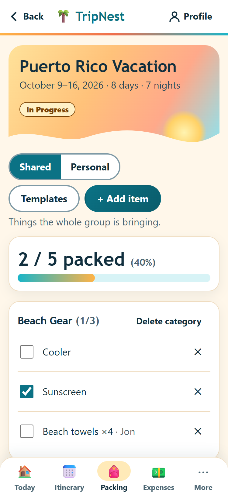
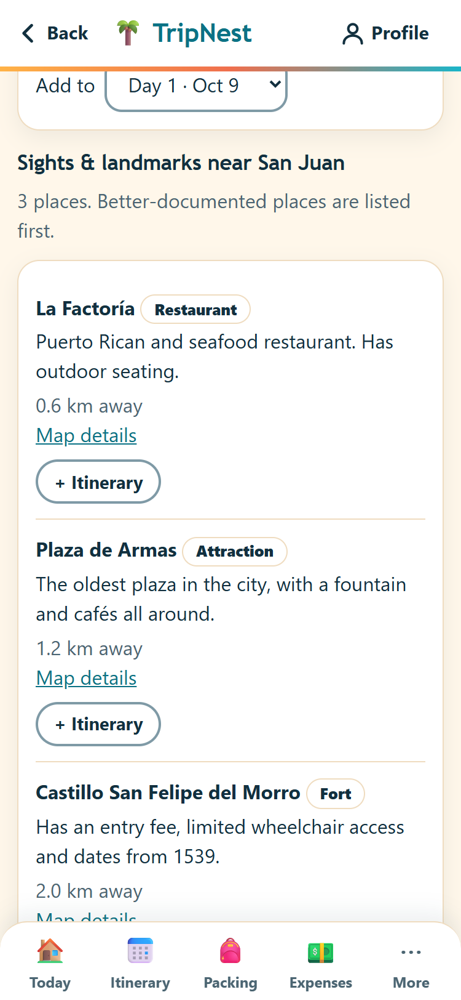
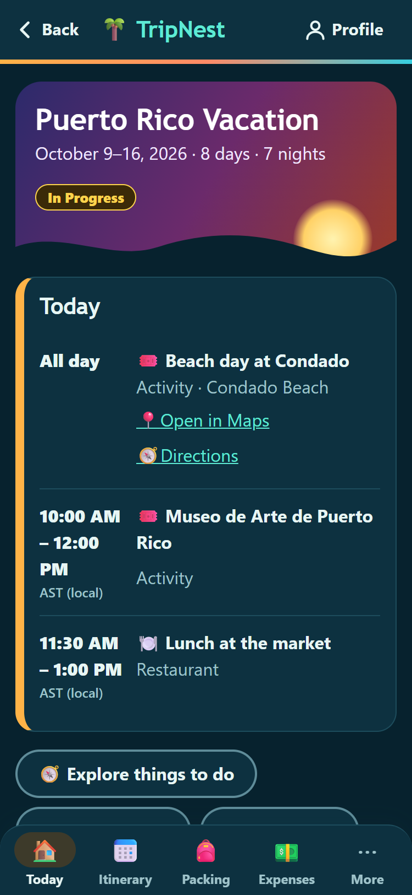

# 🌴 TripNest

Plan a trip in one place: itinerary, reservations, packing, shared expenses with fair splitting, budgets, notes, documents, maps and calendar export. Built for phones, works offline, and **everything stays on your own device**. There are no accounts, no servers and no sign-up.

**Live:** https://michellefeliciano.github.io/tripnest/ (add it to your home screen for an app-like experience)

<p>
  
  
  
  
  
  
  
</p>

<sub>Screenshots use a made-up sample trip. Regenerate them with <code>npm run docs:screenshots</code>.</sub>

## How it works
TripNest is a static web app. Trips are stored in your browser (IndexedDB) on the device you use, so each phone has its own private copy. To protect against lost data or to move a trip to another phone, download a backup or a trip file from the app and import it elsewhere. Nothing is uploaded anywhere. The only network requests are optional and only happen when you use them: map tiles and place lookups (OpenStreetMap) for the map and Explore, and weather (Open-Meteo), which is off until you turn it on. Open in Maps links just open your maps app when you tap them.

## Features
- **Trips**: dates validated (days/nights calculated), status, destinations, notes, dashboard with today's plan, next item, expenses, packing progress and quick actions.
- **Travelers**: the people on a trip are just names. Choose which one is you.
- **Itinerary** with times in the **local time zone of each place** (a flight can leave Chicago and land in Puerto Rico). Timeline, month calendar, week and day views, schedule-conflict warnings, up/down reordering, and **Open in Maps / Directions** links (Apple Maps on iPhone, Google Maps elsewhere).
- **Reservations & travel details**: flights, hotels, restaurants, activities, rental cars, contacts, with a quick-access page of confirmation numbers.
- **Packing**: shared list plus a personal list per traveler, categories, quantities, assignees, "12 / 20 packed (60%)", five editable templates.
- **Expenses**: equal / custom / percentage / shares splits that always add up exactly, who-owes-whom, simplified settlement plan, partial payments, multi-currency (never silently converted).
- **Budgets**: total and per category, under/near/over with gentle wording.
- **Documents** (PDFs, images) saved on the device, available offline.
- **Explore**: sights, museums, food, beaches and activities near each destination (OpenStreetMap) with short descriptions, added to your itinerary with one tap.
- **To-do list** before you go (due dates, overdue flags, one-tap ideas) and **Copy this trip** as a template for next time.
- **Weather** for your trip days (forecast, or last year's weather as a labelled guide for trips further out), plus packing ideas. Optional.
- **Undo** after deletes and a 30-day **Recently deleted** list.
- **Map**, **search**, **printable booklet / PDF**, **.ics calendar export**.
- **Back up / restore / import a trip file / erase everything**, share a trip or backup through the phone share sheet, and a gentle backup reminder.
- **Works offline** after the first visit, and installs to the home screen.

## Stack
React 18 + TypeScript + Vite (plain CSS) · IndexedDB · Leaflet/OpenStreetMap · a generated service worker · Vitest · Playwright. No backend. See [docs/ARCHITECTURE.md](docs/ARCHITECTURE.md).

## Local development
```bash
npm install
npm run dev        # http://localhost:5173
```
No environment variables or accounts are needed.

## Testing
```bash
npm test           # 228 unit, storage and property tests (money, splits, balances, time zones, backups, rules)
npm run build      # typecheck + production build
npm run test:e2e   # browser tests (Edge on a Windows PC, Chromium in CI): every screen on phone/dark/desktop, real user journeys, offline mode
```
See [docs/QA_REPORT.md](docs/QA_REPORT.md) for exactly what was and wasn't verified.

## Deployment
GitHub Pages, deployed by Actions on every push to `main`. Every push and pull request runs the unit tests and the browser tests (in parallel, one job per screen size); only a push to `main` that passes all of them is deployed. See [docs/DEPLOYMENT.md](docs/DEPLOYMENT.md).

## License
[MIT](LICENSE) © 2026 Michelle Feliciano

## Docs
[Architecture](docs/ARCHITECTURE.md) · [Data](docs/DATABASE.md) · [Expense logic](docs/EXPENSE_LOGIC.md) · [Privacy & security](docs/SECURITY.md) · [Data API](docs/API.md) · [Deployment](docs/DEPLOYMENT.md) · [QA report](docs/QA_REPORT.md)
